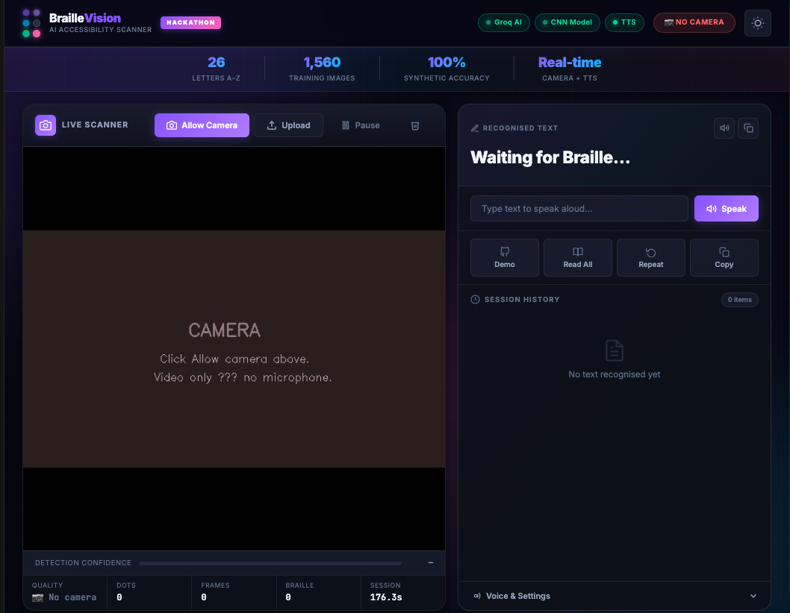

# Braille Vision — AI Accessibility Scanner

> **Real-time Braille OCR with CNN recognition, live camera scanning, and Text-to-Speech.**  
> Built for accessibility. Powered by a **custom synthetic dataset**, PyTorch, and Groq LLaMA.

[](https://python.org)
[](https://pytorch.org)
[](https://flask.palletsprojects.com)
[](LICENSE)

**Repository:** [github.com/atuljha-tech/Braiile-Vision](https://github.com/atuljha-tech/Braiile-Vision)

---

## Dedication & synthetic dataset

This project is the result of hands-on work on **Braille accessibility**: building a pipeline that turns camera frames and uploads into readable, speakable text.

The CNN at its core was trained on a **synthetic Braille cell dataset** created for this project:

| | |
|---|---|
| **Images** | 1,560 (26 letters × 60 variants) |
| **Augmentation** | Position jitter, rotation, Gaussian blur |
| **Generator** | `synthetic_dataset/scripts/generate_dataset.py` |
| **Training** | `synthetic_dataset/scripts/train_model.py` |
| **Weights** | `synthetic_dataset/models/braille_cnn.pth` (~8 MB) |

That dataset and training run are what make single-cell recognition reliable; the geometric decoder and Groq correction extend that to real photos and noisy OCR.

---

## Screenshots

Real captures from **Braille Vision** running locally — upload OCR, dual themes, and live confidence.

| Light theme — image upload | Dark theme — full UI |
|----------------------------|----------------------|
|  |  |
| **ss1** — White/light mode. A Braille image is uploaded; the app decodes and displays **“i am a teacher”** with detection overlay and confidence. | **ss2** — Dark mode. Same scanner with the premium dark theme, status chips, and recognition panel. |

**Links:** [ss1.png](public/ss1.png) · [ss2.png](public/ss2.png)

---

## What it does

1. **Detects** Braille dots (adaptive CV + contour analysis)
2. **Classifies** cells with the trained CNN (A–Z)
3. **Corrects** noisy output with Groq LLaMA 3.1 (optional)
4. **Speaks** results via TTS

---

## Features

| Feature | Details |
|---------|---------|
| Live camera | Browser `getUserMedia` |
| Image upload | Drag-and-drop or file picker |
| CNN | PyTorch, synthetic dataset (1,560 images) |
| Groq AI | LLaMA 3.1-8b-instant correction |
| TTS | pyttsx3 (+ macOS `say` fallback) |
| UI | Dark/light theme, confidence, history |
| Keyboard | Space, R, H, C, U, D shortcuts |

---

## Run locally

### Prerequisites

- **Python 3.9+** (3.11 recommended)
- macOS / Linux / Windows
- Webcam optional (upload works without it)
- **Groq API key** optional ([console.groq.com](https://console.groq.com))

### Steps

```bash
# 1. Clone
git clone https://github.com/atuljha-tech/Braiile-Vision.git
cd Braiile-Vision

# 2. Virtual environment
python3 -m venv venv
source venv/bin/activate          # Windows: venv\Scripts\activate

# 3. Dependencies
pip install -r requirements.txt

# 4. Environment (optional)
cp .env.example .env
# Edit .env → GROQ_API_KEY=gsk_...

# 5. Start server
python3 app.py
```

Open **http://localhost:5050** in Chrome or Edge (best camera support).

### Quick health check

```bash
curl http://localhost:5050/api/health
# → {"status":"ok","cnn":true,"groq":true|false,...}
```

---

## Deploy on Render (step by step)

Braille Vision is one **Flask web service** (UI + API + PyTorch). Render hosts the full app.

### Before you start

- Code is on GitHub: [atuljha-tech/Braiile-Vision](https://github.com/atuljha-tech/Braiile-Vision)
- Optional: [Groq API key](https://console.groq.com) for LLaMA correction
- A [Render](https://render.com) account (free tier works)

---

### Step 1 — Sign in and connect GitHub

1. Open [dashboard.render.com](https://dashboard.render.com).
2. Sign up or log in (GitHub login is easiest).
3. If asked, **authorize Render** to access your GitHub account.

---

### Step 2 — Create a new Web Service

1. Click **New +** (top right) → **Web Service**.
2. Under **Connect a repository**, find **Braiile-Vision** (or `atuljha-tech/Braiile-Vision`).
3. Click **Connect**.  
   If the repo is missing: **Configure account** → grant access to that repo → refresh.

---

### Step 3 — Configure the service

Use these values on the create screen:

| Field | Value |
|-------|--------|
| **Name** | `braille-vision` (or any name; becomes part of the URL) |
| **Region** | Choose closest to you (e.g. Singapore / Oregon) |
| **Branch** | `main` |
| **Runtime** | **Python 3** |
| **Build Command** | `bash build.sh` |
| **Start Command** | `gunicorn app:app -c gunicorn.conf.py` |
| **Instance type** | **Free** (or paid for no sleep) |

Leave **Root Directory** blank unless the app lived in a subfolder.

---

### Step 4 — Add environment variables

Scroll to **Environment Variables** → **Add Environment Variable**.

Add these one at a time:

| Key | Value |
|-----|--------|
| `PYTHON_VERSION` | `3.11.9` |
| `GROQ_API_KEY` | Your key from [console.groq.com](https://console.groq.com) (optional but recommended) |
| `DISABLE_SERVER_TTS` | `1` (server has no speakers; UI uses browser speech) |
| `OMP_NUM_THREADS` | `1` (keeps memory low on free tier) |

**Do not** set `PORT` — Render injects it automatically.

---

### Step 5 — Deploy

1. Click **Create Web Service**.
2. Render clones the repo and runs the build (installing PyTorch can take **5–15 minutes** on free tier).
3. Watch the **Logs** tab:
   - Build should end with something like `Successfully installed ...`
   - Deploy should show `Listening at: http://0.0.0.0:XXXX`
4. When status is **Live**, open the URL at the top, e.g. `https://braille-vision.onrender.com`.

---

### Step 6 — Verify the live site

1. Open your Render URL in Chrome or Edge.
2. Wait if the free instance was sleeping (first load can take 30–60 seconds).
3. Check health: visit `https://<your-app>.onrender.com/api/health`  
   Expect: `"status":"ok"` and `"cnn":true`.
4. Upload a Braille image (same flow as in **ss1**) and confirm text appears.
5. Toggle **light / dark theme** (as in **ss2**).

---

### Step 7 — After deploy (optional)

| Task | How |
|------|-----|
| **Custom domain** | Service → **Settings** → **Custom Domains** |
| **Redeploy after git push** | Auto if **Auto-Deploy** is on; else **Manual Deploy** → Deploy latest commit |
| **View errors** | **Logs** tab (build + runtime) |
| **Blueprint deploy** | **New +** → **Blueprint** → point at repo `render.yaml` |

---

### Render troubleshooting

| Issue | What to do |
|-------|------------|
| Build timeout / memory | Use `bash build.sh` (CPU-only PyTorch); upgrade to paid instance if needed |
| `Exited with status 1` on deploy | **Start Command** must be `gunicorn app:app -c gunicorn.conf.py` (not the old `--bind` line) |
| `proxies` / Groq TypeError | Fixed in latest repo (`groq>=0.13`); redeploy + set `GROQ_API_KEY` on Render |
| No voice on Render | Expected — speech uses **browser TTS** (Web Speech API); allow sound in the tab |
| `ModuleNotFoundError` | Confirm **Build Command** is `bash build.sh` |
| App crashes on start | Check logs for missing `braille_cnn.pth`; ensure `synthetic_dataset/models/` is in the repo |
| Very slow first page | Free tier cold start — normal |
| Groq not working | Add `GROQ_API_KEY` in Environment and redeploy |

---

## Record a 2-minute demo video (step by step)

Use this script for a hackathon or README demo (~2 minutes). Record **locally** or on your **Render URL** after deploy.

### Before recording

1. App running: `python3 app.py` **or** live Render URL.
2. Browser: Chrome/Edge, **zoom 100%**, window maximized.
3. Prepare one Braille image that decodes to something clear (e.g. the upload that shows **“i am a teacher”**).
4. Close extra tabs and notifications.
5. Choose a recorder (pick one):
   - **macOS:** QuickTime → File → New Screen Recording, or `Cmd + Shift + 5` → Record Selected Portion
   - **Windows:** Xbox Game Bar (`Win + G`) → Capture, or Snipping Tool → screen record
   - **Any OS:** [OBS Studio](https://obsproject.com) (free) — add Display Capture + optional mic

---

### Suggested 2-minute script (~120 seconds)

| Time | What to show | What to say (example) |
|------|----------------|------------------------|
| **0:00–0:15** | Home screen, logo, “Braille Vision” | “This is Braille Vision — an AI accessibility scanner that reads Braille from images and camera.” |
| **0:15–0:25** | Point to Groq / CNN status chips | “It uses a CNN trained on my synthetic dataset plus optional Groq LLaMA correction.” |
| **0:25–0:55** | **Light theme** → Upload → pick image → show **“i am a teacher”** result | “I upload a Braille page; the pipeline detects dots, classifies cells, and outputs readable text.” |
| **0:55–1:10** | Confidence meter / history / Speak if visible | “You get confidence scores, history, and text-to-speech.” |
| **1:10–1:25** | Toggle to **dark theme** (ss2 look) | “The UI supports light and dark themes for comfortable use.” |
| **1:25–1:45** | Optional: camera “Allow” → brief scan, **or** second upload | “You can also use the live camera from the browser.” |
| **1:45–2:00** | End on README/GitHub or Render URL | “Built for accessibility — links in the GitHub repo. Thank you.” |

---

### Recording steps (macOS QuickTime example)

1. Open the app at http://localhost:5050 (or your Render URL).
2. **QuickTime Player** → **File** → **New Screen Recording**.
3. Click **Record** → select the browser window (or full screen).
4. Follow the script table above; speak clearly.
5. Click **Stop** in the menu bar.
6. **File** → **Save** → e.g. `braille-vision-demo.mp4`.
7. Trim to ~2:00 in QuickTime (**Edit** → **Trim**) or iMovie / CapCut if needed.

---

### Recording steps (OBS — any platform)

1. Install OBS → **New Scene** → add **Display Capture** (or **Window Capture** for the browser only).
2. **Settings** → **Output** → Recording format **MP4**, quality **High**.
3. Optional: add **Audio Input Capture** for microphone.
4. Click **Start Recording**, run through the script, **Stop Recording**.
5. File is in **Videos** (or path shown in Settings).

---

### After recording

1. Watch once — cut long pauses; aim for **1:45–2:15**.
2. Upload to YouTube (Unlisted) or attach to hackathon submission.
3. Optional: add to README:

```markdown
## Demo video
[](https://youtu.be/YOUR_VIDEO_ID)
```

---

### B. Vercel (not for this backend)

This repo needs **PyTorch + OpenCV on a long-running server**. Deploy on **Render** only. Vercel is only relevant if you later add a separate static frontend that calls your Render API (`NEXT_PUBLIC_API_URL=https://your-app.onrender.com`). Keep `GROQ_API_KEY` on Render, not Vercel.

---

## Model & dataset

### Architecture

```
64×64 grayscale cell
  → Conv2d(1→32) + ReLU + MaxPool
  → Conv2d(32→64) + ReLU + MaxPool
  → Linear → 26 classes (A–Z)
```

### Reproduce training

```bash
python3 synthetic_dataset/scripts/generate_dataset.py
python3 synthetic_dataset/scripts/train_model.py
```

---

## Project structure

```
├── app.py                    # Flask server
├── Procfile                  # Render / Heroku start
├── render.yaml               # Render blueprint
├── public/ss1.png, ss2.png   # README screenshots
├── braille_ocr/realtime/     # Camera, TTS, detection
├── braille_ai/               # CNN + Groq correction
├── synthetic_dataset/        # Dataset, scripts, model
├── templates/ + static/      # Web UI
└── requirements.txt
```

---

## API (summary)

| Method | Endpoint | Description |
|--------|----------|-------------|
| GET | `/` | Web UI |
| GET | `/api/health` | Health check |
| GET | `/api/status` | Scanner status |
| POST | `/api/upload` | Image upload |
| POST | `/api/process_frame` | Webcam frame (base64) |
| POST | `/api/speak` | TTS |

Full list: see earlier docs in repo or hit `/api/health` after deploy.

---

## Environment variables (local `.env`)

```env
GROQ_API_KEY=your_groq_api_key_here
PORT=5050
```

`PORT` is optional locally (defaults to `5050`). On Render, use Render’s `PORT` only.

---

## Keyboard shortcuts

| Key | Action |
|-----|--------|
| Space | Pause / resume |
| R | Repeat last text |
| H | Read history |
| C | Copy last text |
| U | Upload |
| D | Demo |

---

## License

MIT — see [LICENSE](LICENSE).

---

*Built with care for accessibility. Every person deserves to read.*
